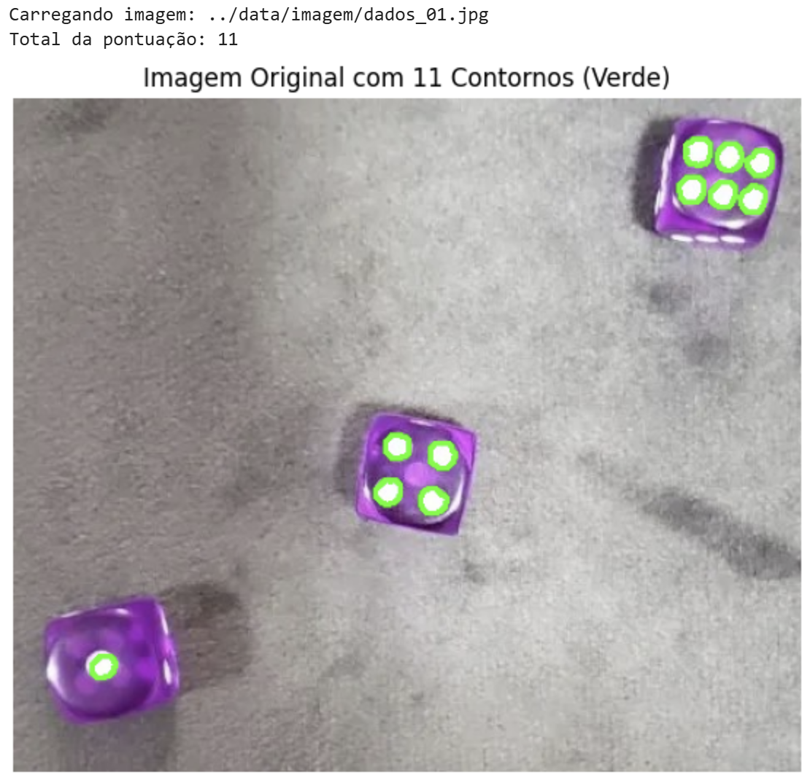

# Detecção e Contagem Automática de Pontos em Dados com Visão Computacional


## Sobre o Projeto

Este projeto consiste em um pipeline completo de Visão Computacional para identificação e contagem automática dos pontos presentes em faces de dados.

A solução utiliza técnicas clássicas de processamento digital de imagens para segmentar os pontos brancos, remover ruídos, identificar contornos e calcular automaticamente a pontuação total presente em cada imagem.

## Objetivo

Desenvolver um sistema capaz de:

- Detectar automaticamente os pontos visíveis nas faces dos dados de jogo;
- Realizar segmentação de objetos utilizando limiarização;
- Aplicar operações morfológicas para redução de ruídos;
- Identificar contornos correspondentes aos pontos detectados;
- Calcular automaticamente a quantidade total de pontos presentes na imagem.

## Principais Atividades Desenvolvidas

### Leitura e Pré-processamento de Imagens

- Carregamento de imagens utilizando OpenCV;
- Conversão do espaço de cor BGR para RGB;
- Conversão para escala de cinza para simplificação do processamento.

### Segmentação por Limiarização

- Aplicação de thresholding para destacar regiões de interesse;
- Isolamento dos pontos brancos presentes nos dados;
- Geração de imagens binárias para facilitar a detecção.

### Operações Morfológicas

- Aplicação de erosão para remoção de ruídos;
- Aplicação de dilatação para recuperação das estruturas relevantes;
- Refinamento das regiões segmentadas.

### Detecção de Contornos

- Extração automática dos contornos dos pontos detectados;
- Utilização de algoritmos de análise de formas do OpenCV;
- Contagem automática das regiões identificadas.

### Visualização dos Resultados

- Desenho dos contornos detectados sobre a imagem original;
- Comparação entre etapas do processamento;
- Validação visual da qualidade da detecção.

### Processamento em Lote

- Automação da análise para múltiplas imagens;
- Avaliação do desempenho em um conjunto de dez imagens distintas;
- Padronização do pipeline para diferentes cenários.

## Tecnologias Utilizadas

- Python
- OpenCV
- NumPy
- Matplotlib

## Competências Demonstradas

- Visão Computacional
- Segmentação de imagens
- Thresholding e binarização
- Operações morfológicas
- Detecção de contornos
- Automação de pipelines de processamento de imagens
- Processamento em lote
- Desenvolvimento de soluções utilizando OpenCV

## Fluxo da Solução

```text
Imagem Original
      │
      ▼
Conversão RGB → Escala de Cinza
      │
      ▼
Thresholding
      │
      ▼
Operações Morfológicas
      │
      ▼
Detecção de Contornos
      │
      ▼
Contagem dos Pontos
      │
      ▼
Visualização dos Resultados
```

## Estrutura do Projeto

```text
├── data/
│   └── imagem/
│       ├── dados_01.jpg
│       ├── dados_02.jpg
│       ├── ...
│       └── dados_10.jpg
├── deteccao_faces_dados.ipynb
└── README.md
```

## Bibliotecas Utilizadas

- Python
- OpenCV
- NumPy
- Matplotlib

## Resultados Obtidos

O pipeline desenvolvido foi capaz de identificar automaticamente os pontos presentes nos dados e calcular sua pontuação total de forma consistente. O projeto demonstra uma aplicação prática de técnicas clássicas de Visão Computacional voltadas para detecção de objetos e análise automatizada de imagens.

**Notebook do projeto:**[ aqui.](https://github.com/deivison1983/Deteccao_pontos_faces_dados/blob/main/notebook/deteccao_faces_dados.ipynb)


## Aplicações Práticas

- Controle de qualidade industrial;
- Contagem automática de objetos;
- Inspeção visual automatizada;
- OCR e digitalização de documentos;
- Reconhecimento de padrões;
- Sistemas inteligentes de monitoramento.

## Contexto Acadêmico

Projeto desenvolvido durante a Pós-Graduação em Inteligência Artificial e Aprendizado de Máquina, com foco na aplicação prática de técnicas de segmentação e detecção de objetos em imagens digitais.

## Autor

Deivison Morais. Visite o meu portfólio de projetos [aqui.](https://deivison1983.github.io/portfolio_projetos/)

Pós-Graduação em Inteligência Artificial e Aprendizado de Máquina - PUC Minas

Professor Orientador: Octavio Santana

### Contatos

<div>
  <a href = "https://www.linkedin.com/in/deivisonmorais/"></a>
  <a href = "mailto:deivison1983@gmail.com"></a>
</div>
